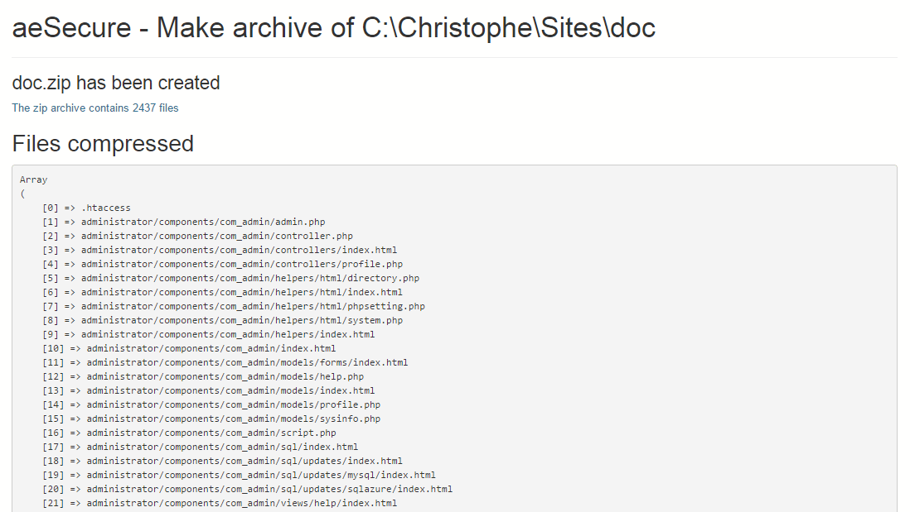

# Zip

> Need a simple script to take an archive of your website. The repository contains a script to create a ZIP archive of a website (or part of it).

Just put `zip.php` on your website root folder (or any sub-folders) and start the script to get a ZIP file.

## Table of Contents

- [Install](#install)
- [Usage](#usage)
- [License](#license)

## Install

1. Make a right-click on the hyperlink to [zip.php](https://raw.githubusercontent.com/cavo789/zip_unzip/zip.php) and select `save the target of the link as` so you can save the file on your hard disk.
2. With a FTP client, copy the downloaded file onto your web folder (the root folder or any folder you want to compress)

## Usage

Start a browser and run the file i.e go to f.i. `https://your_site/zip.php`.

The script will start immediately, there is nothing to do except wait until the archive is created and output is displayed.

**Don't forget to remove the script once you've finished with it.**

Please note that this script will just "try" to create the archive : there is no mechanism in it to handle f.i. very large website (several hundred megabytes) nor handle CPU timeout (defined by your hosting company). This script is "a simple one", feel free to suggest improvements.

### License

[MIT](LICENSE)
